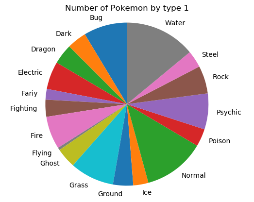
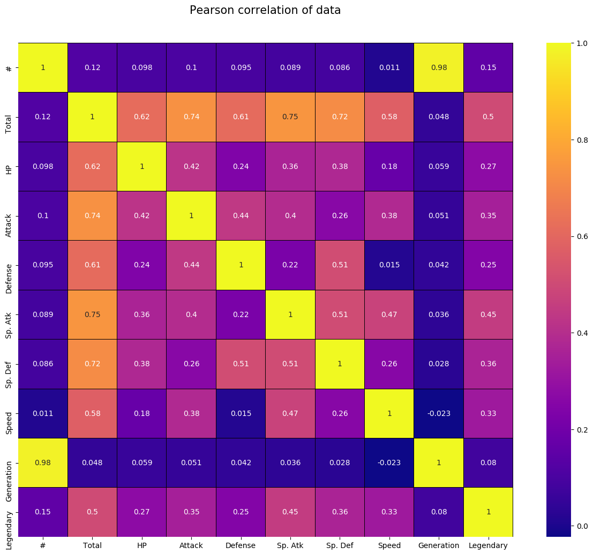

# Python in RStudio

Python blocks of code can be written in Rmarkdown and knited with knitr. For example:

```{python}
python_string = "Hello World"
print(python_string)
```

However unlike R code blocks the data does not transfer from code block to code block. This means you have to import packages and data every code block. This is fine for some short examples or for a graph or two but will get tiresome and wordy very quickly if you want to explain steps more indepth. I recomend avoiding markdown and python untill better support is created for larger projects, but if you want to use python in a blog then I would break your posts down to smaller chunks. Such as this:

```{python}
import numpy as np
import pandas as pd
import matplotlib.pyplot as plt
import seaborn as sns
#import libraries

pokemon = pd.read_csv('Pokemon.csv')
#import data

# Looking at the breakdown of type 1
type_count = pd.value_counts(pokemon['Type 1'], sort = True).sort_index()
labels = ['Bug', 'Dark', 'Dragon', 'Electric', 'Fariy', 'Fighting', 'Fire',
         'Flying', 'Ghost', 'Grass', 'Ground', 'Ice', 'Normal', 'Poison', 'Psychic',
         'Rock', 'Steel', 'Water']
sizes = type_count

fig1, ax1 = plt.subplots()
ax1.pie(sizes, labels = labels, startangle=90)
ax1.axis('equal')  # Equal aspect ratio ensures that pie is drawn as a circle.

plt.title('Number of Pokemon by type 1')
plt.savefig('pie1.png', bbox_inches='tight')
#plt.show()

```


Or like this:

```{python}
import numpy as np
import pandas as pd
import matplotlib.pyplot as plt
import seaborn as sns
#import libraries

pokemon = pd.read_csv('Pokemon.csv')
#import data

colormap = plt.cm.plasma
plt.figure(figsize=(16,12))
plt.title('Pearson correlation of data', y = 1.05, size = 15)
sns.heatmap(pokemon.corr(), linewidths=0.1, vmax=1.0, square=True, cmap=colormap, linecolor='black', annot=True)
plt.savefig('heat1.png', bbox_inches='tight')
#plt.show()
#color map looking at Pearson correlations
```



And then commenting on what you have done, or the findings.